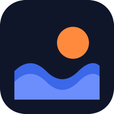

<div align="center">



# SuperCove

**A personal-ops app you actually own.**
Tasks, calendar, money, notes, habits and contacts in one place — running on
your own database, on your own domain.

[Setup](docs/setup.md) · [Configuration](docs/configuration.md) ·
[Deploying](docs/deploy.md) · [Make it yours](docs/customizing-with-ai.md)

[](LICENSE)

</div>

---

## What this is

Most people run their life across a spreadsheet, a calendar, a notes app, and a
chat thread where they track who owes them money. SuperCove is what happened
when one person got tired of that and built the single thing instead.

It is **not a service**. There's no hosted version to sign up for, no account
with anyone, no pricing page. You run it yourself, against a Supabase project
you control, and your data sits in a database with your name on it.

It's built for one person per install — that's why it's fast and why it's
simple. If you want a team tool, this isn't it.

## What's in it

| | |
|---|---|
| **Today** | Dashboard: agenda, quick capture, day progress, follow-ups, countdowns |
| **Todos** | Day / week / month lists, Eisenhower priorities, carry-over that doesn't lie about a task's age |
| **Calendar** | Day agenda and a retrospective time logger. Google Calendar sync optional |
| **Notes** | Markdown with attachments, across projects or loose |
| **Finance** | Expenses, incoming payments, follow-up chasing |
| **Habits** | Month-scoped grid with a contribution heatmap |
| **Projects** | Kanban, per-project notes, files and spend |
| **Inventory** | Products and sales that post to the finance ledger automatically |
| **Stats** | Where the time and the money actually went |
| **Scrapbook** | Free-form boards of draggable images and text |
| **Contacts · Key Dates · Weekly Review · Global search** | |

Plus: works offline (writes queue and sync on reconnect), installs as a PWA on
phone and desktop, light and dark, encrypted backups you can restore without
this app, and optional morning push reminders.

**Switch off what you don't want.** Settings → Modules. A module that's off
doesn't just hide — its code is never downloaded and its tables are never
queried.

## No AI inside

SuperCove never calls a language model at runtime.
Nothing you write in it gets sent anywhere for inference or tracking.

SuperCove doesn't ship with any AI features, and if this does change, it will be an optional add-on and NOT global, and won't be enabled by default.
If you do wish to incorporate AI features on top of the knowledge based created on SuperCove, please do it in a forked repository (this is an open challenge for contributors btw!). 

Using AI to *modify the code* is very much encouraged. That's
[a whole guide](docs/customizing-with-ai.md).

## Getting started

You need Node 20+ and a free [Supabase](https://supabase.com) account.

```bash
git clone https://github.com/volvotkar/SuperCove-OSS.git
cd SuperCove-OSS
npm install
cp .env.example .env.local     # then fill in your Supabase URL and anon key
```

Create the schema, **add your own email to the allowlist** (the app is private
by default and rejects everyone until you do), and run it:

```bash
npx supabase link --project-ref YOUR_PROJECT_REF
npx supabase db push
npm run dev
```

Full walkthrough, including running everything locally with Docker:
**[docs/setup.md](docs/setup.md)**.

## Making it yours

This is a personal-ops app. The version you run should fit your life, not mine.

The codebase is small, conventionally structured, and ships an `AGENTS.md` so AI
coding tools understand it without you re-explaining. Changing the colours, the
copy, the modules, or adding your own — that's the intended use, not a fork you
have to justify. See [docs/customizing-with-ai.md](docs/customizing-with-ai.md).

## Contributing

Yes please — issues, bug reports and pull requests are all welcome. See
[CONTRIBUTING.md](CONTRIBUTING.md).

Bear in mind it's opinionated: single-user, no global AI features, and features stay
optional rather than mandatory. A change that makes it a team/AI product is
probably a fork rather than a PR, and that's a fine thing to do.

## Licence

[AGPL-3.0](LICENSE). Use it, change it, run it, share it. If you run a modified
version as a service for other people, you have to publish your changes under
the same license.

That's the whole point: this stays a thing people can own, and improvements come
back to everyone. It's not a soft copyleft. And if that doesn't work for you,
don't use it.

**The name is not covered by the licence.** "SuperCove", "LemonByte" and its logo are not
included and are property of the developer and LEMONBYTE LLP; forks must use their own name and branding. See [NOTICE](NOTICE).

## Credits

Built by [Priyanshu Volvotkar](https://github.com/volvotkar) (and Claude!) at
[LemonByte](https://lemonbyte.in), because the spreadsheet stopped scaling ;)
